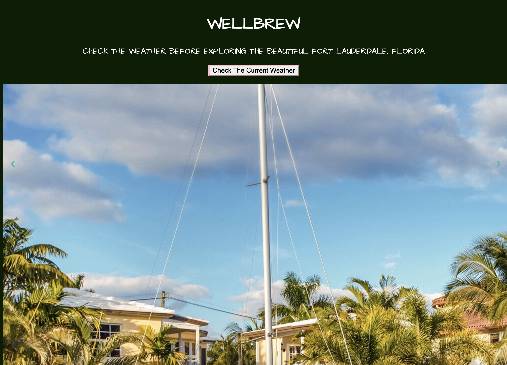
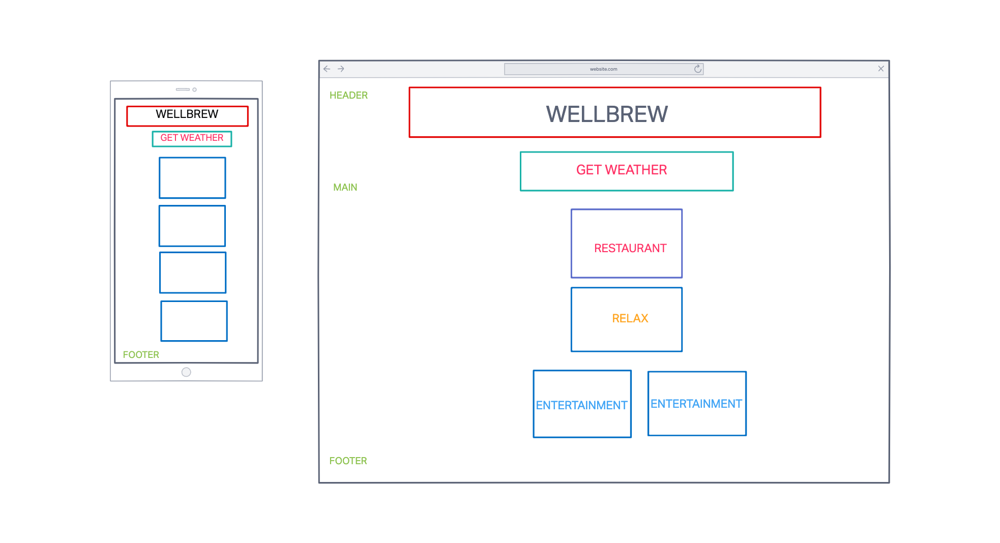

# WELLBREW 

#### A simple web application that displays the weather in Fort Lauderdale, Florida and local activities.

## Description
Wellbrew is my first attempt to create a one page website. The goal was to implement the things that I've learned so far in my bootcamp. 

## Table of Contents
* Technologies Used
* Features
* Sketch
* Project Next Steps
* Deployed App

## Technologies Used
* JavaScript 
* HTML5
* CSS3
* Google Fonts
* Open Weather API
* jQuery

## Features
* App pulls live weather information from a 3rd party API.
* API [Open Weather API]https://openweathermap.org/current
* Main picture displays a slideshow with 4 pictures.
* Restaurant title links to the business pages.

## Sketches
* Wireframe was made using Invision and is located in images folder.

## Trello Planning
* Link to Trello: [Trello]https://trello.com/b/ptDb2iqs/project-1

## Next Steps
* Users will be able to select their city from a drop down menu.
* Website will load a new webpage to display local time, date, weather, recomended restaurants, wellness events and activities.
* Custom media will be applied to webpages.

## Deployment

# chyannerobbins.github.io
# Wellbrew
# Wellbrew
# Wellbrew
